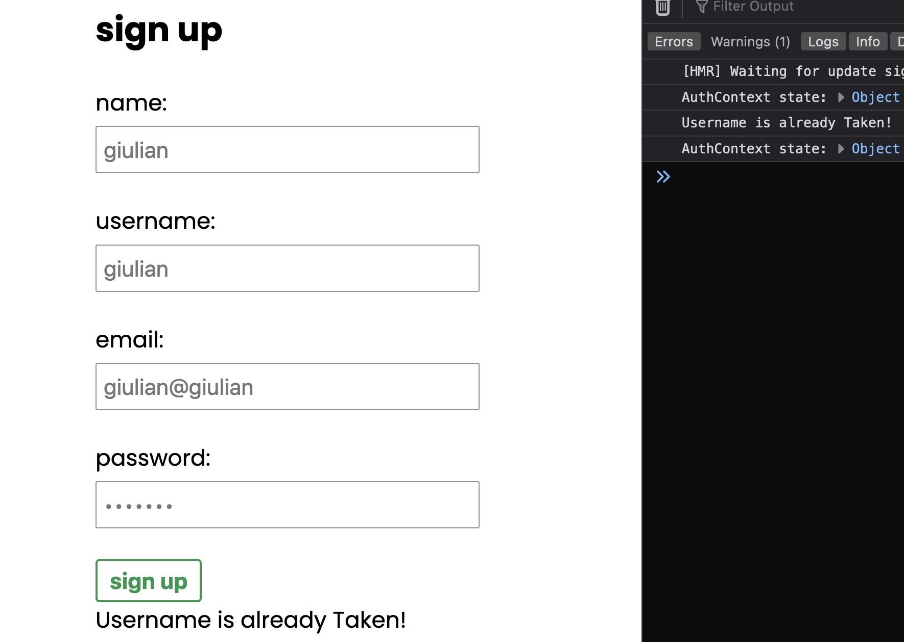

back de una app q voy a hacer con login y signup, el front va en react...

react usando context y hooks para el front, no lo subire todavia

<strong>front token</strong>

responses spring

agregando validaciones en react

login manda usuario, logout null al context user 

logged in, ADD transactions page, token localstorage+username

